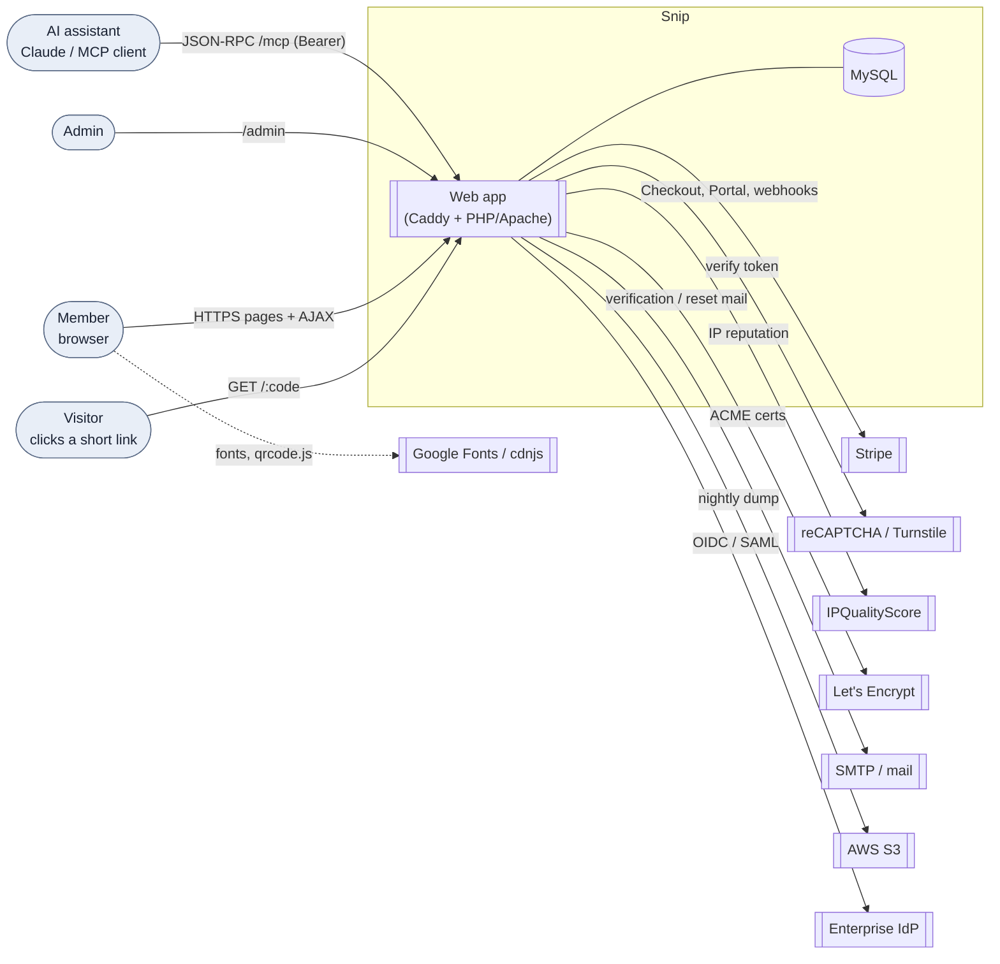
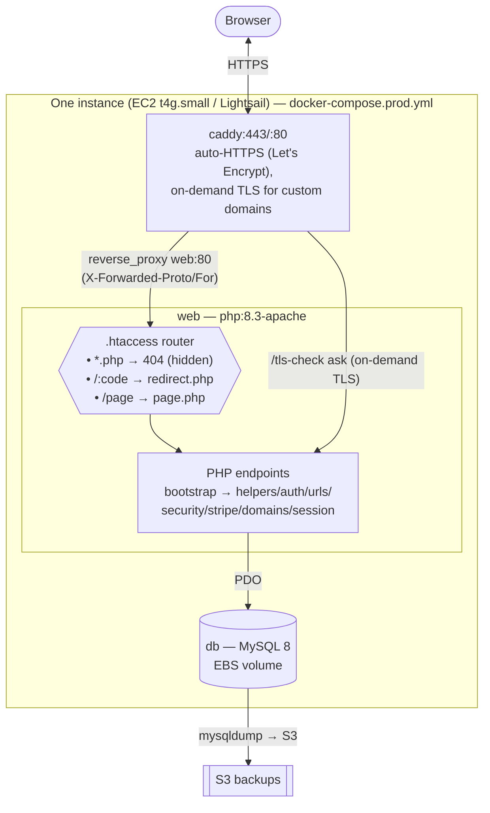
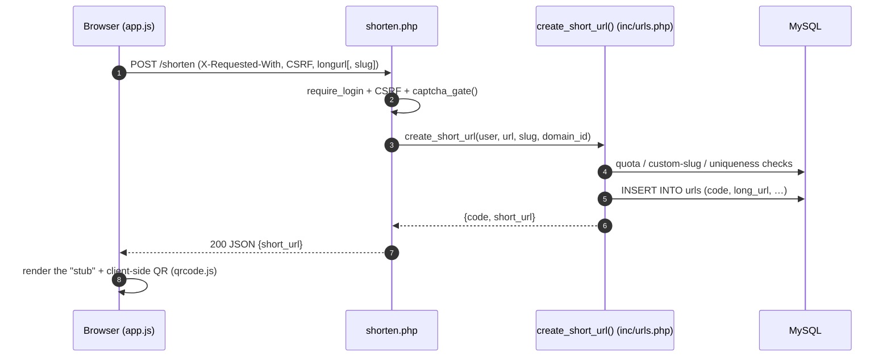
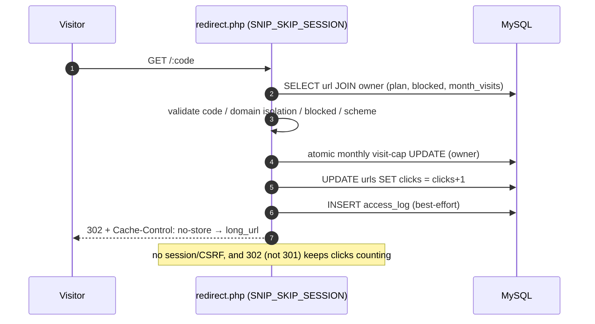
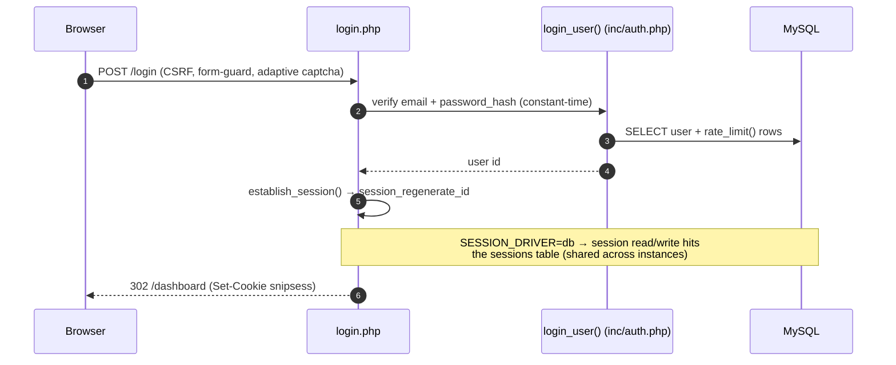
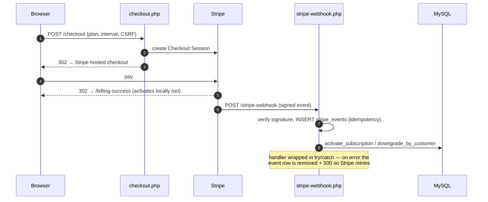
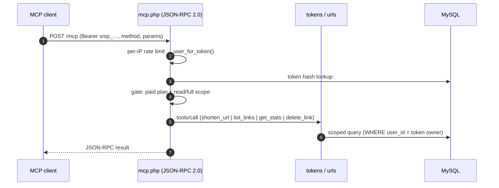
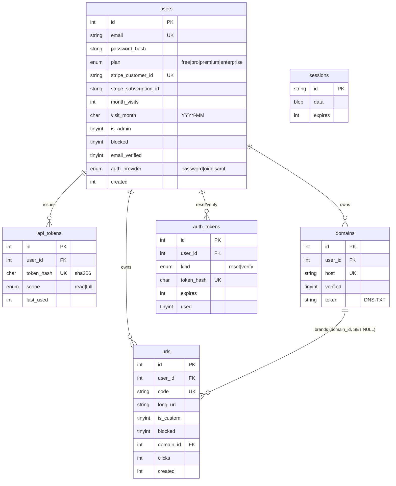
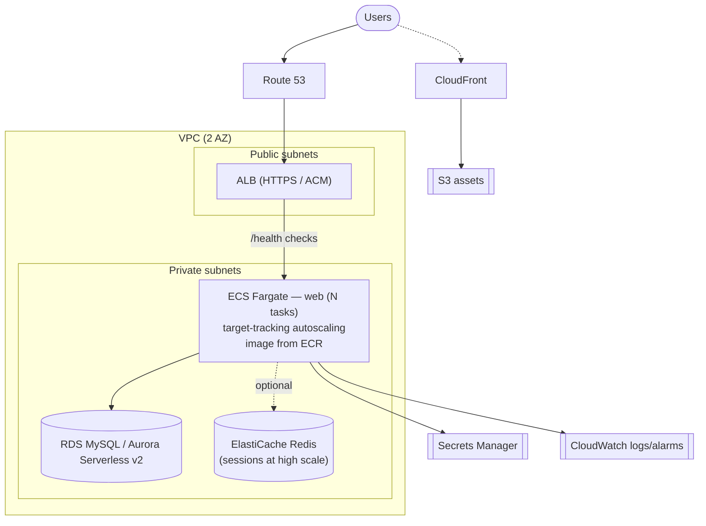

# Snip — Architecture

Snip is a **server-rendered PHP monolith** (no separate SPA/API tier): the same
Apache/PHP process renders HTML pages, answers AJAX/JSON for the shorten box,
speaks JSON-RPC to AI clients over MCP, resolves short-code redirects, and
receives Stripe webhooks. All persistent state lives in **MySQL**. TLS and
routing are handled at the edge by **Caddy**.

The "UI ↔ API ↔ DB" boundary is therefore logical rather than physical:
- **UI** = server-rendered pages (`inc/layout.php` shell) + a thin JS layer
  (`assets/app.js`: AJAX submit, copy, QR, theme toggle).
- **API** = the PHP endpoints (`shorten.php`, `redirect.php`, `mcp.php`, the
  auth/billing/admin handlers) — every one boots through `inc/bootstrap.php`.
- **DB** = MySQL, accessed only via PDO prepared statements in `inc/*.php`.

> All diagrams below are [Mermaid](https://mermaid.js.org) — they render on
> GitHub, in VS Code (Markdown Preview Mermaid), and at mermaid.live.

---

## 1. System context — who talks to Snip, and to whom Snip talks

External calls are all **optional / feature-gated**: Stripe (paid plans),
reCAPTCHA/Turnstile/IPQS (abuse defense), IdP (Enterprise SSO), SMTP (email —
falls back to a dev log), S3 (backups). Core shortening works with none of them.

---

## 2. Runtime — current single-box deployment (Docker Compose)

Key edge behaviors: TLS terminates at Caddy; PHP reads `X-Forwarded-Proto`
(`REQUEST_HTTPS`) and `X-Forwarded-For` (`client_ip()`, gated by
`TRUSTED_PROXIES`). PHP is never exposed directly (`*.php` → 404); the stack is
even fingerprint-spoofed to look like IIS/ASP.NET.

---

## 3. Communication flows (UI ↔ API ↔ DB)

### 3a. Create a short link (AJAX)

### 3b. Resolve a short code (the hot path)

### 3c. Login + session (files today, DB-backed when scaled)

### 3d. Billing (Stripe Checkout + webhook)

### 3e. MCP (AI assistant → tools → DB)

---

## 4. Data model

**Unattached operational tables** (no FK; shared-state, so already
multi-instance-safe): `rate_limits`, `security_log`, `access_log`,
`ip_reputation`, `stripe_events`, `enterprise_leads`, `schema_migrations`.
This is why the *only* code change needed for horizontal scaling was moving
**sessions** off the local filesystem into `sessions` (`SESSION_DRIVER=db`).

---

## 5. Scale topology (documented target — see AWS-SCALE-ARCHITECTURE.md)

The app is already scale-ready for this: `SESSION_DRIVER=db` (or Redis) removes
the sticky-session requirement, `/health` drives ALB target health,
`scripts/migrate.php` runs as a one-off task against RDS, secrets come from
`.env` (→ Secrets Manager), and `client_ip()`/`REQUEST_HTTPS` already read the
forwarded headers. The remaining hard problem — TLS for Enterprise custom
domains behind a load balancer — and the cost thresholds for graduating are
covered in `docs/AWS-SCALE-ARCHITECTURE.md`.
